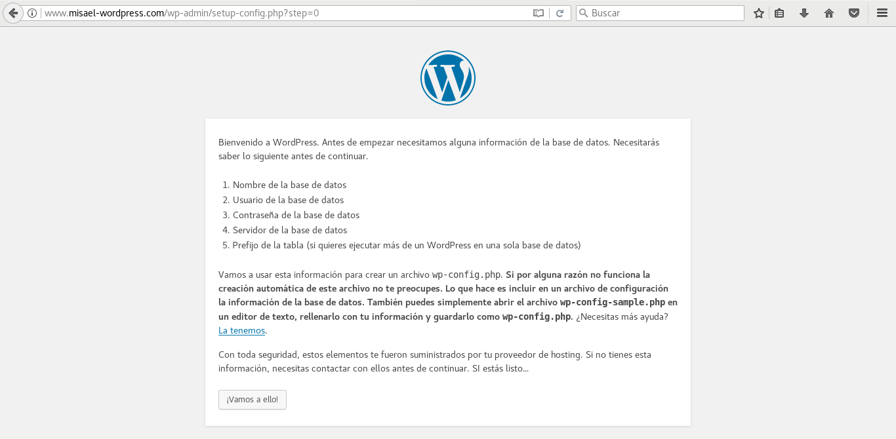
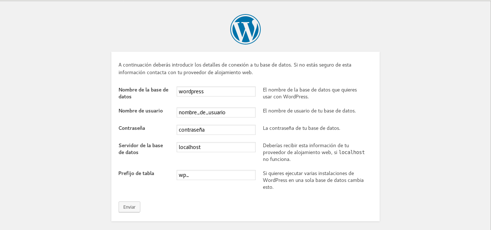
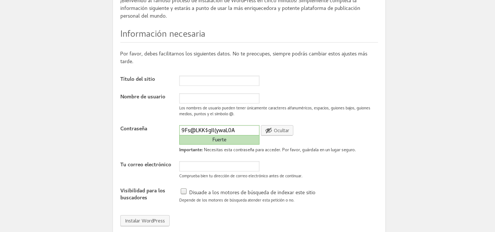
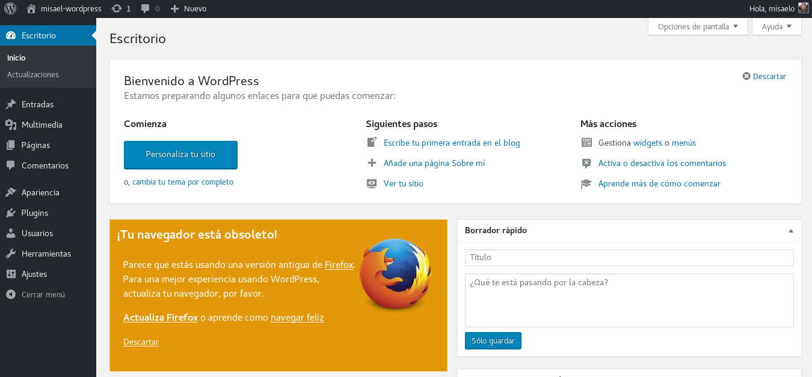
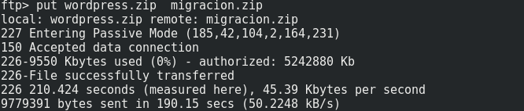
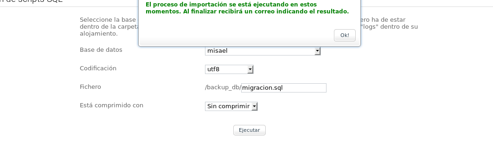
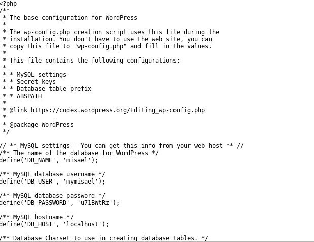
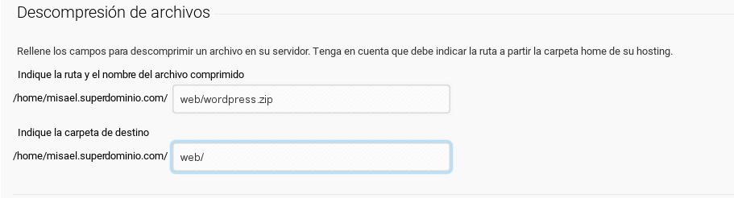
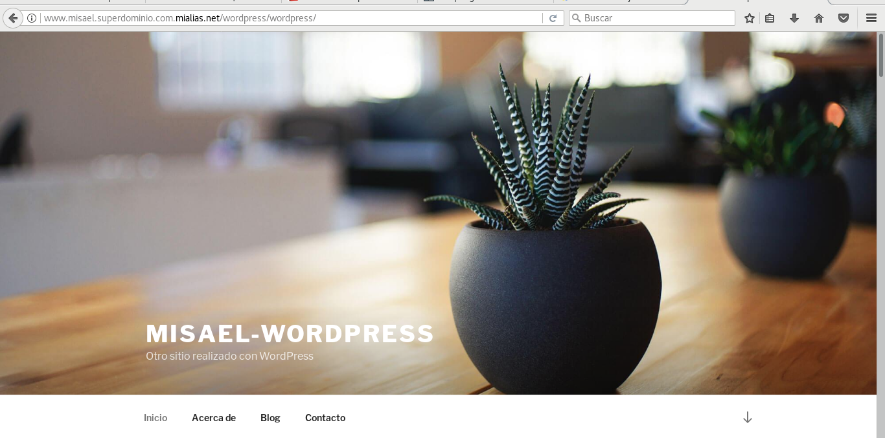
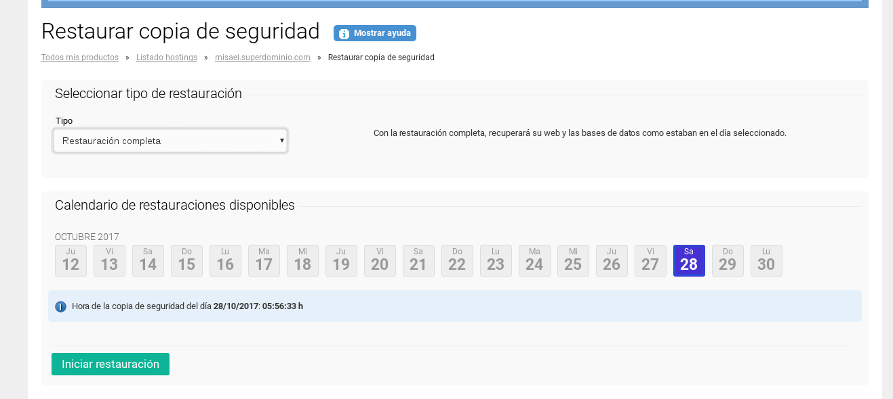

Despliege Tradicional de un CMS PHP : 

## Esta Practica consta de las siguientes tareas :

1. [eleccion opcion](#tarea1)
2. [InstalacionCMS](#tarea2)
3. [Migracion](#tarea4)
4. [copias de seguridad](#tarea5)
## Tarea1

He elegido la opcion de instalar un servidor dedicado y luego migrarlo a un hosting externo de internet .

## Tarea2 

Como opcion a instalar he decidido instalar Wordpress en virtual hosting 

-primero configuramos nuestro virtual hosting y nuestro /etc/hosts para resolver estaticamente la direccion de nuestro hosting y instalar 

 

-Ahora introducimos los datos de nuestra base de datos para que la aplicacion se conecte :

-Si la informacion es correcta , solo nos queda seguir los pasos de instalacion y seguir rellenando datos 

-accedemos a wordpress y introducimos nuestro usuario y contraseña :

ya tenemos y podemos perfeccionar nuestro sitio web .

## Tarea4

-Ahora , Debemos migrar nuestro servidor dedicado a una pagina de hosting externa :

-Como hosting externo he elegido cdmon (en su version gratuita de pruebas) 

-ahora subimos los archivos del CMS mediante ftp a nustro hosting :

~~~	
	ftp "direccion ip de nuestro dominio"

	nos logueamos
~~~

-nos situamos en la carpeta de instalacion y Comprimimos los documentos de nuestro CMS instalado :

~~~
 zip -r wordpress.zip wordpress/
~~~ 

-Una vez dentro pasamos los archivos al servidor , con el comando "put" ( yo he enviado el archivo comprimido para luego descomprimirlo desde el cpanel de CDMON )

~~~
	ftp> put wordpress.zip migracion.zip
~~~
	
al completar el envio , estara en nuestro dominio 

tambien creamos una copia de la base de datos de nuestro servidor local y la enviamos a el hosting 
~~~
mysqldump --user=debian --password="contraseña" "Base de datos"  > migracion.sql
~~~

Ejecutamos el script en el hosting :

IMPORTANTE : al descomprimir , tenemos que entrar en nuestra carpeta de wordpress , y editar el wp-config.php para que apunte a la base de datos y el usuario mysql que tendremos en nuestro hosting . un ejemplo : 

ahora , me he ido al gestor de archivos de mi hosting y he descomprimido el archivo comprimido de wordpress en la carpeta /web

una vez descomprimidos , nos vamos a la url  como si de nuestro virtualhosting se tratara en nuestra maquina fisica :

Si queremos añadir alguna funcionalidad mas a nuestra pagina , debemos subir un modulo o tema a nuestro hosting a traves de ftp y activarlo como lo hicimos la anterior vez en [Practica 1](./Practica1.md).

## Tarea 5 

- Para hacer una copia de seguridad de nuestra aplicacion , la mayoria de hostings te da opcion a gestionarlas, por ejemplo , en cdmon :

 

- Podemos automatizar estos procesos mediante plugins y aplicaciones , por ejemplo , en wordpress hay un plugin llamado BackWPup , que permite realizar copias de seguridad automaticas y enlazarla a una cuenta de dropbox configurada previamente , aqui os dejo un enlace :

[copia](https://youtu.be/FKwRBLpSNhE)

