## Esta practica consta de las siguientes tareas :

1. [Iniciacion Django](#tarea1) 
2. [Entorno de Produccion](#tarea2) 

## Tarea1

clonamos el repositorio 

~~~
git clone https://github.com/josedom24/django_tutorial.git
~~~

-Creamos un entorno virtual : 
~~~
virtualenv   (carpeta) 

source   bin/activate
~~~

-Abrimos el fichero /settings.py y vemos a ver que base de datos utilizara :
~~~
vim /settings.py 
~~~

abrimos el fichero settings.py y vemos la base de datos que utilizara 

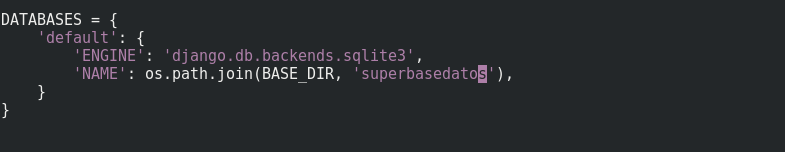
	

ejecutamos el script manage.py que nos permite realizar varias tareas 

	python manage.py migrate 

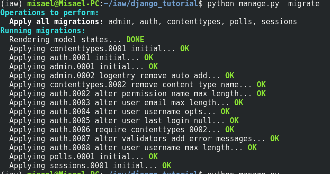

el script crea la base de datos segun el modelo polls/model.py

ahora creamos un superuser para administrar el sitio 

	python manage.py createsuperuser

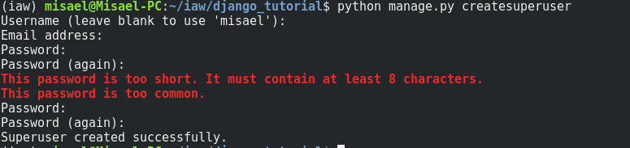

ejecutamos la opcion 'runserver'
~~~
		python manage.py runserver
~~~
nos metemos en la pagina :
~~~
		http://127.0.0.1:8000/admin/ 
~~~
introducimos los datos del superusuario y nos lleva a la siguiente pagina 

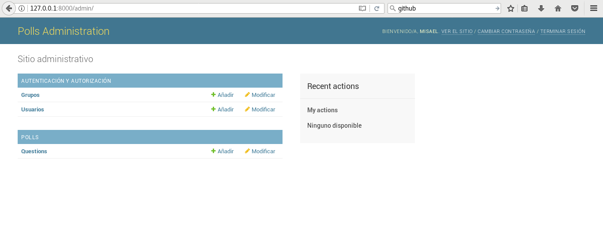(https://misaelo2.github.io./Practica2)

añadimos encuestas 

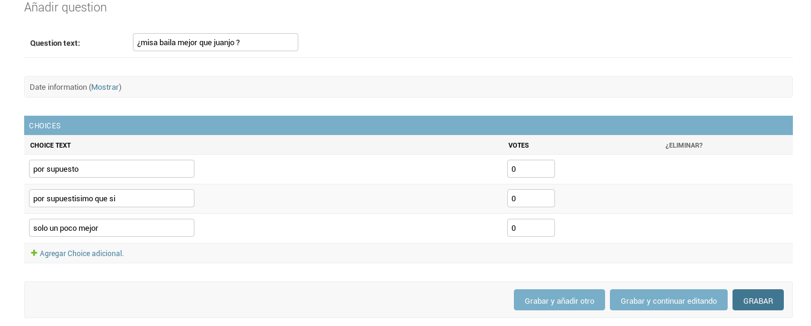

listo , nuestras encuestas ya apareceran en la raiz 

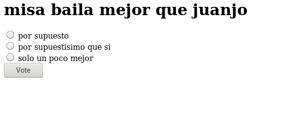

## Tarea2

- Instalamos apache2,git,python  y el modulo wsgi para ejecutar python : 

~~~
apt-get install apache2 

apt-get install libapache2-mod-wsgi

apt-get install git

apt-get install python-django
~~~

- nos movemos a nuestro document root por defecto en apache y clonamos el repositorio 

~~~
cd /var/www/html

git clone  https://github.com/josedom24/django_tutorial
~~~

- Configuramos  nuestro servidor apache para que sirva la aplicacion :

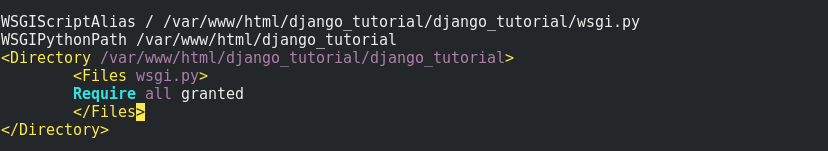

- Creamos base de datos 

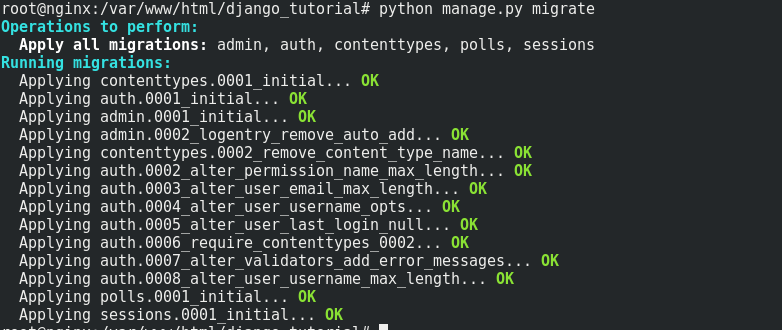

- Creamos un super user 

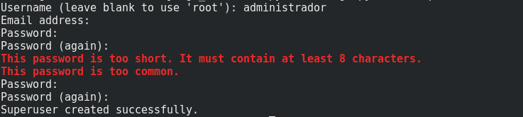

- Desactivamos el debug a false : 

~~~
vim settings.py 
~~~

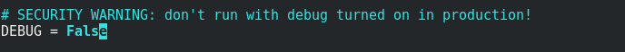

nota : cambiar los permisos a www-data:www-data  con el comando 
~~~
chown -r www-data:www-data /django_tutorial
~~~

-Accedemos a la pagina web /admin

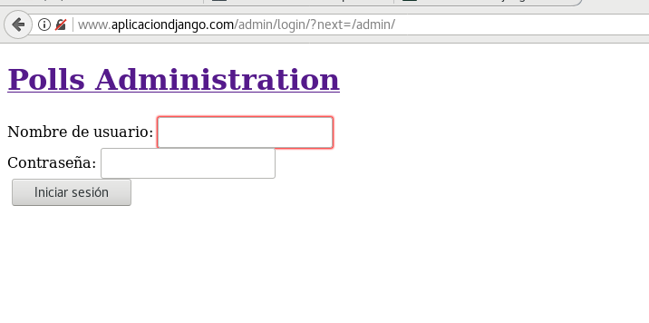

-Nos logueamos y estamos en el menu administracion para crear encuestas :

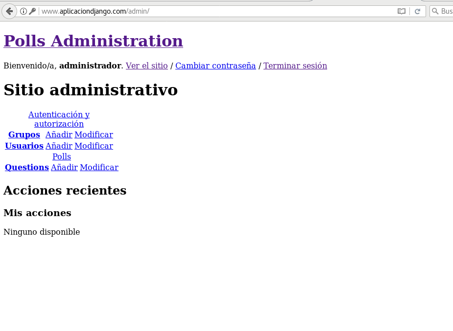

-Se ve sin hoja de estilos porque por defecto django deja al servidor web que ejecuta la aplicacion servir los estilos . 
