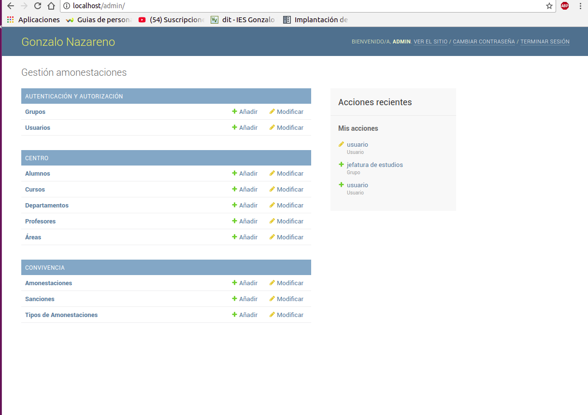

Consta de las siguientes Ejercicios

1. [Ejecucion de una aplicacion web python en Docker ](#tarea1)

2. [Ejecucion de una aplicacion web python  en Docker (2) ](#tarea2)

3. [Ejecucion de una aplicacion web python en Docker (3)](#tarea3)

4. [Ejecucion de CMS python en docker ] (#tarea4)

5. [Ejecucion de CMS python  en docker  (2) ] (#tarea5)

# Tarea1 

Una vez visto como hemos desplegado aplicaciones php en docker , ahora lo haremos para aplicaciones python .

Para eso disponemos de una aplicacion escrita en python del IES gonzalo nazareno por el magnifico profesor :

[gestiona](https://github.com/josedom24/gestion)

Como es habitual , clonamos el repositorio y creamos un dockerfile con lo necesario para desplegar la imagen :
~~~
FROM debian

WORKDIR /var/www/html/

ADD iaw_gestionGN/ /var/www/html/

ADD gestion.conf /etc/apache2/sites-available/gestion.conf 

RUN apt-get update \
&& apt-get install -y apache2 \
.&& apt-get install  -y  python python-pip libapache2-mod-wsgi \
&& apt-get install python-dev

EXPOSE 80

RUN pip install -r requirements.txt \
&& python manage.py migrate \
&& python manage.py loaddata  datos.json \
&& a2ensite gestion.conf 

CMD apachectl -D FOREGROUND
~~~

Retocamos los siguientes ficheros de la aplicacion :
1. gestion/settings.py
~~~
DATABASES = {
    'default': {
        'ENGINE': 'django.db.backends.sqlite3',
        'NAME': '/var/lib/SuperDB',
    }
}
~~~

2. Creamos el fichero que configurara apache para servir nuestra aplicacion
~~~
ServerName www.iaw-gestiona.com

        ServerAdmin webmaster@localhost
        DocumentRoot /var/www/html/

	Alias /static/ /var/www/html/static/

	<Directory  /var/www/html/static/>
	Require all granted
	</Directory>

	
	WSGIDaemonProcess www.iaw-gestiona.com python-path=/var/www/html/
        WSGIProcessGroup www.iaw-gestiona.com
        WSGIScriptAlias / /var/www/html/gestion/wsgi.py

	
        <Directory /var/www/html/gestion>
                <Files wsgi.py>
                Require all granted
                </Files>
        </Directory>
~~~ 

Ahora creamos la imagen del contenedor que contendra la base de datos , guardaremos la base de datos en un volumen para no tener que crearla mas veces 
~~~
docker volume create gestion
~~~

Y ahora ejecutamos el comando run especificando que la base de datos se guarde en nuestro contenedor 
~~~
docker run -d --name gestion -v gestion:/var/lib/SuperDB -p 80:80  gestiongn1 
~~~

Y comprobamos que la aplicacion funciona correctamente 

 

# Tarea2 

Ahora Desplegaremos la aplicacioncon un contenedor mysql y la aplicacion en un contenedor con la imagen de python oficial 

Primero tenemos que crear un Dockerfile que creara nuestra aplicacion

~~~
FROM python:2

WORKDIR /gestion

ADD  iaw_gestionGN/ /gestion

RUN pip install --no-cache-dir -r requirements.txt \
&& python manage.py loaddata datos.json

~~~

y ahora creamos el docker compose :

~~~
version: '3'

services:
  db:
    image: mysql
    environment:
      MYSQL_ROOT_PASSWORD: root
      MYSQL_DATABASE: gestion 
      MYSQL_USER: gestion
      MYSQL_PASSWORD: gestion
  web:
    build: .
    command: python manage.py runserver 0.0.0.0:8000
        ports:
      - "8000:8000"
    depends_on:
      - db
~~~

***IMPORTANTE : si tienes una version docker compose que no soporta esta version de fichero , usa esta***
~~~
mysql:
   image: mysql
   environment:
      MYSQL_ROOT_PASSWORD: root
      MYSQL_DATABASE: gestion
      MYSQL_USER: gestion
      MYSQL_PASSWORD: gestion
   volumes:
     - gestion:/var/lib/mysql
gestion:
   image: gestiongn2
   command: python manage.py runserver 0.0.0.0:80
   links:
      - mysql
   ports:
      - "80:80
~~~

Y modificamos nuestra aplicacion para que se conecte a una base de datos 

en el fichero settings.py :

~~~
DATABASES = {
    'default': {
        'ENGINE': 'django.db.backends.mysql',
        'NAME': 'gestion',
        'USER': 'gestion',
        'PASSWORD': 'gestion',
        'HOST': 'mysql',
        'PORT': '3306',
    }
}
~~~

Ahora tenemosla aplicacion funcionando , pero tendremos que rellenar y crear la base de datos 

~~~
 docker exec root_gestion_1 python manage.py migrate
~~~

y ahora lo rellenamos
~~~
docker exec root_gestion_1 python manage.py loaddata datos.json
~~~

Con esto , ya solo nos queda acceder a la aplicacion 

# Tarea3

Ahora desplegaremos tres contenedores , mysql , nuestra aplicacion de django en un contenedor nginx  y un contenedor proxy 

Nuestro Dockerfiles:

~~~
FROM nginx AS gestion 

ADD ./gestion.conf /etc/nginx/conf.d/default.conf

RUN nginx -s reload

CMD ["nginx", "-g", "daemon off;"]
~~~

~~~
FROM Ubuntu AS gunicorn

WORKDIR /gestion

RUN apt-get update \
&& apt-get install -y gunicorn \
&& gunicorn -w 2 -b 0.0.0.0:8080 wsgi.py
~~~
 

Este es nuestro fichero de configuracion de nginx :
~~~
server {
    listen       80;
    server_name  localhost;

    #charset koi8-r;
    #access_log  /var/log/nginx/host.access.log  main;

    location / {
        root   /usr/share/nginx/html;
        index  index.html index.htm;
    }

    #error_page  404              /404.html;

    # redirect server error pages to the static page /50x.html
    #
    error_page   500 502 503 504  /50x.html;
    location = /50x.html {
        root   /usr/share/nginx/html;
    }

    # proxy the PHP scripts to Apache listening on 127.0.0.1:80
    #
    #location ~ \.php$ {
    #    proxy_pass   http://127.0.0.1;
    #}

    # pass the PHP scripts to FastCGI server listening on 127.0.0.1:9000
    #
    #location ~ \.php$ {
    #    root           html;
    #    fastcgi_pass   127.0.0.1:9000;
    #    fastcgi_index  index.php;
    #    fastcgi_param  SCRIPT_FILENAME  /scripts$fastcgi_script_name;
    #    include        fastcgi_params;
    #}

    # deny access to .htaccess files, if Apache's document root
    # concurs with nginx's one
    #
    #location ~ /\.ht {
    #    deny  all;
    #}
}
~~~
