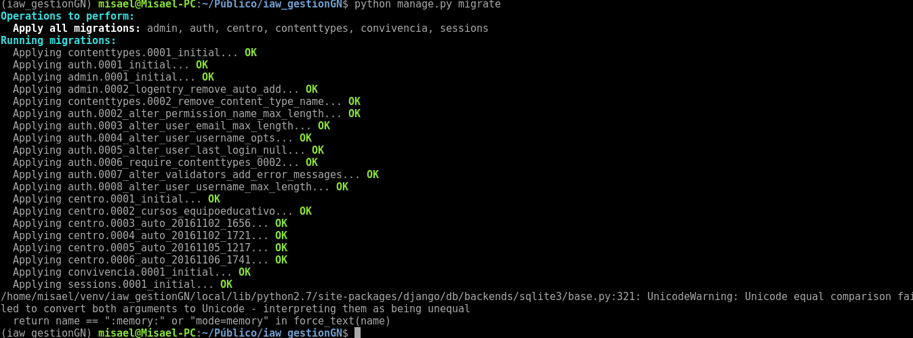

Entorno de Desarrollo y produccion con aplicacion web python con Django

## Esta Practica consta de las siguientes tareas :

1. [Entorno de desarrollo](#tarea1)
2. [Desarrollo de nuestra aplicacion](#tarea2)
3. [Entorno de produccion](#tarea3)
4. [Modificacion en entorno de produccion](#tarea4)
5. [Despliege en un hosting python](#tarea5)

## Tarea1

Nuestro equipo sera el entorno de desarrollo donde desarrollaremos y haremos pruebas con una aplicacion web sobre python ,para ello 
tenemos que configurar nuestro equipo como entorno de desarrollo .

-Primero , Hacemos un fork del repositorio de github que tiene el contenido de la aplicacion web Y lo clonamos a nuestro equipo .
~~~
git clone [repositorio]
~~~

-Luego , cremamos un entorno virtual , yo lo suelo crear todos en una misma carpeta llamada "venv"
~~~	
virtualenv [nombredeentorno]
source bin/activate
~~~

-Una vez en el entorno virtual , nos metemos en el repositorio clonado de la aplicacion e instalamos los requisitos para nuestra aplicacion :
~~~
pip install -r requirements.txt
~~~

Nota : yo he tenido que instalar las cabeceras en mi quipo para que "pip" pudiera compilar python 

~~~
apt-get install python-dev
~~~

-Comprobamos el nombre de la base de datos que vamos a crear , se encuentra en gestion/settings.py
~~~
DATABASES = {
    'default': {
        'ENGINE': 'django.db.backends.sqlite3',
        'NAME': os.path.join(BASE_DIR, 'SuperDB'),
    }
}
~~~

-Nuestra base de datos se llamara SuperDB

-Creamos la base de datos :
~~~
python manage.py migrate 
~~~

-Poblamos nuestra Base de datos :
~~~
python manage.py loaddata  datos.jason 
~~~
-Ahora observamos que los datos se han añadido correctamente entrando en la zona de administracion "/admin"

-Ahora ejecutamos el script manage.py para correr un servidor web de desarrollo :
~~~
python manage.py runserver
~~~

-Introducimos las credenciales "usuario" y "asdasd1234" y conectamos para comprobar que funciona :

## Tarea2

Ahora comenzaremos a desarrollar nuestra aplicacion aplicando cambios y comprobando que se realizan adecuadamente .

-Realizamos cualquier cambio en la aplicacion , como por ejemplo , que se cambie nuestro nombre .

-Subimos los cambios al repositorio :
~~~
git commit -am 'modificando cambios'
git push
~~~
-Mostramos el fichero cambiado en el repositorio :

## Tarea3

-Ahora vamos a subir nuestra aplicacion a un entorno de produccion :

-Nos conectamos a la maquina e instalamos los servicios necesarios 

-Clonamos el repositorio en el Documentroot de la pagina que serviremos 

-Creamos un entorno virtual y instalamos las dependencias necesarios como hicimos en el entorno de produccion 
~~~
pip install -r requirements.txt
~~~
-Instalamos el modulo que permite que python trabaje con mysql :
~~~
apt-get install python-mysqldb
apt-get install libapache2-mod-wsgi
~~~
-y en el entorno virtual tambien 
~~~
pip install libmariadbclient-dev (para debian 9 stretch)
pip install mysql-python
~~~

-Ahora Creamos un fichero de virtualhost en los que definiremos el nombre de la pagina y la ruta del documentRoot y del wsgi.py para que corra nuestra aplicacion :
~~~
ServerName www.iaw-gestiona.com

        ServerAdmin webmaster@localhost
        DocumentRoot /var/www/iaw_gestionGN
        
        WSGIDaemonProcess www.iaw-gestiona.com python-path=/var/www/iaw_gestionGN:/home/debian/venv/iaw_gestiona/lib/python2.7/site-packages 
        WSGIProcessGroup www.iaw-gestiona.com
        WSGIScriptAlias / /var/www/iaw_gestionGN/gestion/wsgi.py

        
        <Directory /var/www/iaw_gestionGN/gestion>
                <Files wsgi.py>
                Require all granted
                </Files>
        </Directory>
~~~

-Creamos una base de datos y un usuario en mysql

-Ahora , en la aplicacion modificamos el archivo "settings.py" y definimos la base de datos a utilizar :
~~~

DATABASES = {
              'default': {
                            'ENGINE': 'django.db.backends.mysql',
                                      'NAME': 'iaw_gestion',
                                                'USER': 'gestiona',
                                                          'PASSWORD': 'gestiona',
                                                                    'HOST': 'localhost',
                                                                              'PORT': '',
                                                                                    }
                }
~~~
-Es hora de crear la base de datos  y cargar los datos de prueba :
~~~
python manage.py migrate
python manage.py loaddata  datos.json
~~~
-Si accedemos a Mysql podemos observar los datos creados .

-Recordad acceder a nuestro Settings.py y poner el debug a False y insertar la pagina que puede usar nuestra aplicacion en allowed_hosts

 

## Tarea4

-Ahora realizaremos una modificacion en el entorno de desarrollo y la subiremos al entorno de produccion

-En el entorno de desarrollo , hacemos que muestre otra imagen en la ventana principal , modificando el index.html

-Añadimos un archivo .gitignore al repositorio y escribimos "settings.py" para que no suba el settings.py y no modifique la del entorno de produccion 

-Hacemos commit y subimos los cambios al repositorio 

-Ahora hacemos un pull en el entorno de produccion y nos apareceran los cambios 

-Cada cambio que realizemos en produccion , asi prodemos con un simple pull en produccion , crear la nueva version , por ejemplo podemos 
añadir una nueva tabla modificando centro/models.py
