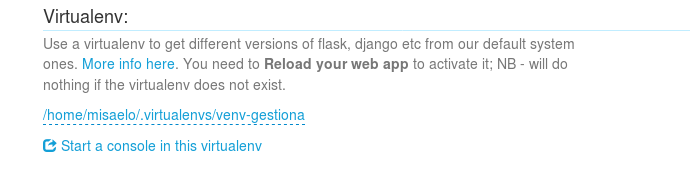

Entorno de Desarrollo y produccion con aplicacion web python con Django

## Esta Practica consta de las siguientes tareas :

1. [Entorno de desarrollo](#tarea1)
2. [Desarrollo de nuestra aplicacion](#tarea2)
3. [Entorno de produccion](#tarea3)
4. [Modificacion en entorno de produccion](#tarea4)
5. [Despliege en un hosting python](#tarea5)

## Tarea1

Nuestro equipo sera el entorno de desarrollo donde desarrollaremos y haremos pruebas con una aplicacion web sobre python ,para ello 
tenemos que configurar nuestro equipo como entorno de desarrollo .

-Primero , Hacemos un fork del repositorio de github que tiene el contenido de la aplicacion web Y lo clonamos a nuestro equipo .
~~~
git clone [repositorio]
~~~

-Luego , cremamos un entorno virtual , yo lo suelo crear todos en una misma carpeta llamada "venv"
~~~	
virtualenv [nombredeentorno]
source bin/activate
~~~

-Una vez en el entorno virtual , nos metemos en el repositorio clonado de la aplicacion e instalamos los requisitos para nuestra aplicacion :
~~~
pip install -r requirements.txt
~~~

Nota : yo he tenido que instalar las cabeceras en mi quipo para que "pip" pudiera compilar python 

~~~
apt-get install python-dev
~~~

-Comprobamos el nombre de la base de datos que vamos a crear , se encuentra en gestion/settings.py
~~~
DATABASES = {
    'default': {
        'ENGINE': 'django.db.backends.sqlite3',
        'NAME': os.path.join(BASE_DIR, 'SuperDB'),
    }
}
~~~

-Nuestra base de datos se llamara SuperDB

-Creamos la base de datos :
~~~
python manage.py migrate 
~~~

-Poblamos nuestra Base de datos :
~~~
python manage.py loaddata  datos.jason 
~~~
-Ahora observamos que los datos se han añadido correctamente entrando en la zona de administracion "/admin"

-Ahora ejecutamos el script manage.py para correr un servidor web de desarrollo :
~~~
python manage.py runserver
~~~

-Introducimos las credenciales "usuario" y "asdasd1234" y conectamos para comprobar que funciona :

## Tarea2

Ahora comenzaremos a desarrollar nuestra aplicacion aplicando cambios y comprobando que se realizan adecuadamente .

-Realizamos cualquier cambio en la aplicacion , como por ejemplo , que se cambie nuestro nombre .

-Subimos los cambios al repositorio :
~~~
git commit -am 'modificando cambios'
git push
~~~
-Mostramos el fichero cambiado en el repositorio :

## Tarea3

-Ahora vamos a subir nuestra aplicacion a un entorno de produccion :

-Nos conectamos a la maquina e instalamos los servicios necesarios 

-Clonamos el repositorio en el Documentroot de la pagina que serviremos 

-Creamos un entorno virtual y instalamos las dependencias necesarios como hicimos en el entorno de produccion 
~~~
pip install -r requirements.txt
~~~
-Instalamos el modulo que permite que python trabaje con mysql :
~~~
apt-get install python-mysqldb
apt-get install libapache2-mod-wsgi
~~~
-y en el entorno virtual tambien 
~~~
pip install libmariadbclient-dev (para debian 9 stretch)
pip install mysql-python
~~~

-Ahora Creamos un fichero de virtualhost en los que definiremos el nombre de la pagina y la ruta del documentRoot y del wsgi.py para que corra nuestra aplicacion :
~~~
ServerName www.iaw-gestiona.com

        ServerAdmin webmaster@localhost
        DocumentRoot /var/www/iaw_gestionGN
        
        WSGIDaemonProcess www.iaw-gestiona.com python-path=/var/www/iaw_gestionGN:/home/debian/venv/iaw_gestiona/lib/python2.7/site-packages 
        WSGIProcessGroup www.iaw-gestiona.com
        WSGIScriptAlias / /var/www/iaw_gestionGN/gestion/wsgi.py

        
        <Directory /var/www/iaw_gestionGN/gestion>
                <Files wsgi.py>
                Require all granted
                </Files>
        </Directory>
~~~

-Creamos una base de datos y un usuario en mysql

-Ahora , en la aplicacion modificamos el archivo "settings.py" y definimos la base de datos a utilizar :
~~~

DATABASES = {
              'default': {
                            'ENGINE': 'django.db.backends.mysql',
                                      'NAME': 'iaw_gestion',
                                                'USER': 'gestiona',
                                                          'PASSWORD': 'gestiona',
                                                                    'HOST': 'localhost',
                                                                              'PORT': '',
                                                                                    }
                }
~~~
-Es hora de crear la base de datos  y cargar los datos de prueba :
~~~
python manage.py migrate
python manage.py loaddata  datos.json
~~~
-Si accedemos a Mysql podemos observar los datos creados .

-Recordad acceder a nuestro Settings.py y poner el debug a False y insertar la pagina que puede usar nuestra aplicacion en allowed_hosts

 

## Tarea4

-Ahora realizaremos una modificacion en el entorno de desarrollo y la subiremos al entorno de produccion

-En el entorno de desarrollo , hacemos que muestre otra imagen en la ventana principal , modificando el index.html

-Añadimos un archivo .gitignore al repositorio y escribimos "settings.py" para que no suba el settings.py y no modifique la del entorno de produccion 

-Hacemos commit y subimos los cambios al repositorio 

-Ahora hacemos un pull en el entorno de produccion y nos apareceran los cambios 

-Cada cambio que realizemos en produccion , asi prodemos con un simple pull en produccion , crear la nueva version , por ejemplo podemos 
añadir una nueva tabla modificando centro/models.py

## Tarea5

-Ahora subiremos  nuestra aplicacion hecha en django a un hosting de python llamado PythonAnywhere

-Nos creamos una cuenta y a traves del navegador ejecutamos una terminal y seguimos los pasos descritos en la documentacion 

1 subimos nuestro codigo , en mi caso , mediante Github
~~~
git clone repositorio
~~~
2 creamos un entorno virtual e instalamos las dependencias requeridas en nuestro "requirements.txt" 
~~~ 
mkvirtualenv --python=/usr/bin/python3.4 mysite-virtualenv
~~~
  *Nota : al instalar django , es normal que tarde un poquitin* .
	
3 Ahora tenemos que tener en cuenta tres cosas :
	-La ruta de la aplicacion de django (la carpeta mas alta,donde esta "manage.py")
	-La ruta del proyecto (el directorio que contiene el fichero "settings.py")
	-El nombre de nuestro entorno virtual 

	 
una vez nos hacemos con esas tres rutas 

creamos una web app con configuracion manual en el panel web

Seleccionamos la version de python que vamos a utilizar , (la que creamos en el virtualenv)

Una vez creada la aplicacion , buscamos en la aplicacion e introducimos la ruta de nuestro entorno virtual en mi caso es :
~~~
/home/misaelo/.virtualenvs/venv-gestiona
~~~
Tal que asi

Ahora hay que editar nuestro fichero WSGI.py , pero no el de nuestro proyecot django , ya que el sistema de pythonanywhere ignorara este fichero y creara uno
en la ruta donde nuestro codigo esta , para averiguarla , en el panel grafico nos vamos a las pestañas web y miramos la seccion "code"

Como vemos la ruta de mi wsgi.py esta en "/var/www/misaelo_pythonanywhere_com_wsgi.py"

Editamos ese fichero y borramos la aplicacion "hello world " de prueba que estaran en las primeras lineas

Ahora borramos todo excepto la seccion "Django" y la descomentamos , quedaria una cosa asi
~~~
# +++++++++++ DJANGO +++++++++++
 47 # To use your own django app use code like this:
 48 import os
 49 import sys                                                                                                                                       
 50
 51 # assuming your django settings file is at '/home/misaelo/mysite/mysite/settings.py'
 52 # and your manage.py is is at '/home/misaelo/mysite/manage.py'
 53 path = '/home/misaelo/mysite'
 54 if path not in sys.path:
 55     sys.path.append(path)
 56
 57 os.environ['DJANGO_SETTINGS_MODULE'] = 'mysite.settings'
 58
 59 # then, for django >=1.5:
 60 from django.core.wsgi import get_wsgi_application
 61 application = get_wsgi_application()
 62 # or, for older django <=1.4
 63 import django.core.handlers.wsgi
 64 application = django.core.handlers.wsgi.WSGIHandler()
~~~

 * Ahora cojemos el ficheor wsgi de nuestro proyecto y lo pegamos aqui  y modificamos para que quede parecido a esto :
~~~
 # +++++++++++ DJANGO +++++++++++
 import sys
 import os
 path = '/home/misaelo/iaw_gestionGN'
 if path not in sys.path:
     sys.path.append(path)                             
 from django.core.wsgi import get_wsgi_application

 os.environ.setdefault("DJANGO_SETTINGS_MODULE", "gestion.settings")

 application = get_wsgi_application()
~~~

Guardamos el fichero y recargamos la aplicacion 

Ahora creamos una base de datos , (mysql en mi caso) . Python anywhere te facilita esta tarea teniendo que introducir solo contraseña.

Ingresamos a la consola de nuestra base de datos una vez , salimos y nos aseguramos de que nuestro fichero settings.py tiene configurado una base de datos mysql.
~~~
  DATABASES = {
      'default': {
          'ENGINE': 'django.db.backends.mysql',
          'NAME': '', (base de datos creada por defecto )
          'USER': '', (nombre de usuario creado)
          'PASSWORD': '',(contraseña asignada)
          'HOST': '', (nombre de host que da pythonanywhere)
          'PORT': '',
      }
  }
~~~
Ahora migramos la base de datos 

~~~
python manage.py migrate
~~~

Si todo va bien nos saldra algo como esto :

*No olvidemos poner a False el debug para que no nos muestre informacion sensible a la aplicacion* .

Ahora , por ultimo , nos encargamos de los ficheros estaticos.

En pythonAnywhere podemos servir los ficheros estaticos de tres formas doferentes 

1-Modificando el "static_root" in settings.py 

2-Ejecutando ~~~ manage.py collecstatic ~~~ 

3-En la interfaz web de pythonanywhere , establecer la ruta de tus ficheros estaticos (he elegido esta ya que va mucho mas rapido al no cargarlas desde el disco de la maquina)

	Para eso , nos vamos a nuestra app , y en la seccion de static files escribimos lo siguiente :

 

Listo , Como podemos observar , en unos sencillos pasos tendremos nuestra app funcionando 

.
