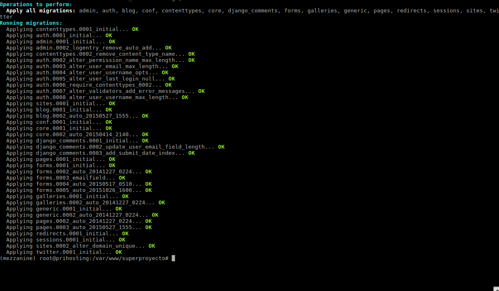
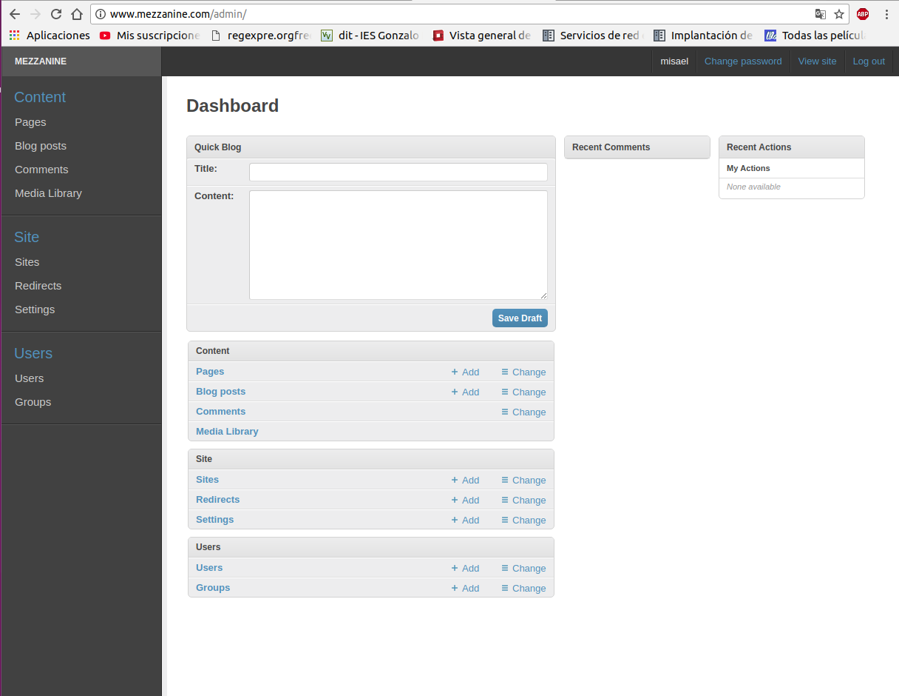

Esta practica consta de las siguientes tareas :

1. [Instalacion de Mezzanime](#tarea1)
2. [Migracion a entorno de produccion](#tarea2)

## Tarea1

Vamos a instalar Mezzanime y configurarlo en el entorno de produccion.

-Existen varias maneras de instalar Mezzanime , una de ellas consiste en crear un entorno virtual e instalarlo mediande la herramienta "pip"
~~~
virtualenv -p /usr/bin/python3 mezzanine
source bin/activate
pip install mezzanine
~~~
-Esto no los instalara con sus dependencias , pero ahora tendremos que generar un proyecto con el siguiente comando 
~~~
mezzanine-project (ruta y nombre)
~~~
-Esto nos creara una serie de ficheros segun la ruta especificada , lo subimos a un repo de github para poder trabajar luego en un entorno de produccion 

-Si echamos un vistazo a la estructura de ficheros , nos suena ¿eh? , es parecido a Django , asi que creamos una base de datos y la rellenamos como un pavo de objetos de prueba. 
~~~
python manage.py createdb --noinput
~~~
*createdb no es mas que un acceso rapido a "migrate" de django , si no quieres añadir opciones de prueba añade "--nodata"*

-Una vez creada la base de datos y que todo nos aparesca en color verde ( todo sabemos que el verde es bueno *ejem* ) , ejecutamos el servidor de pruebas y accedemos a la aplicacion via web .
~~~
python3 manage.py runserver
~~~

-Ahora , la aplicacion esta funcionando y esta operativa 

-vamos a  modificar algo , para ello , creamos un superuser 
~~~
python3 manage.py createsuperuser
~~~

-Ahora nos vamos a la zona de administracion 

-Creamos una nueva pagina y añadimos algo 

-Lo guardamos y nos volvemos a la pagina inicial , en la que nos aparecera la nueva pagina creada 

-Ahora veremos como subirlo a un entorno de produccion. 

## Tarea2

Esta tarea la realizare con las siguientes caracteristicas :
1. Entorno virtual con python3
2. Usando Apache
3. Usando PostgresQL
4. Usando una URL del tipo "www.mipagina.com"

-Comenzamos creanto un entorno virtual ( en python3) y instalando los paquetes necesarios mediante el fichero "requirements.txt"
~~~
virtualenv -p /usr/bin/python3 mezzanine
pip install -r requirements.txt
~~~

-Una vez realizada la instalacion de los requisitos , el deploy en el servidor de produccion es casi igual que una aplicacion Django (ver entradas anteriores ) , salvo con algunas excepciones debido a los cambios realizados en este .

-Primero , volvemos a nuestro servidor de desarrollo y en el repositorio creamos una copia de la base de datos para pasarsela luego 
al servidor de produccion y realizar la migracion 
~~~
python3 manage.py dumpdata > datos.json
scp datos.json usuario@dominio.com:/home/usuario 
~~~

-Una vez en el servidor de produccion de vuelta , configuramos el servidor web apache para que sirva nuestra aplicacion en un virtualhosting :
~~~
ServerName www.mezzanine.com

        ServerAdmin webmaster@localhost
        DocumentRoot /var/www/superproyecto
        
        WSGIDaemonProcess www.mezzanine.com python-path=/var/www/superproyecto:/home/debian/venv/mezzanine/lib/python3/site-packages
        WSGIProcessGroup www.mezzanine.com
        WSGIScriptAlias / /var/www/superproyecto/superproyecto/wsgi.py

        
        <Directory /var/www/superproyecto/superproyecto>
                <Files wsgi.py>
                Require all granted
                </Files>
        </Directory>
~~~

Listo , ahora nos queda migrar la base de datos (no nos olvidemos de activar el sitio y reiniciar el servido web)

-Como hemos elegido como motor de base de datos PostgresQL , primero hay que instalar unos componentes necesarios :
~~~
sudo apt-get install python-pip python-dev libpq-dev postgresql postgresql-contrib
pip install django psycopg2
~~~

*Puede que ya tengas los paquetes , pero nunca esta demas asegurarse*

-Nos metemos en postgres y creamos una base de datos y usuario y le damos privilegios 

~~~
sudo su - postgres
psql
create database mezzanine;
create user usuario_mezzanine with password ______ ;
~~~
-A continuacion establecemos la codificacion ,la zona horaria , y el tipo de operaciones en el esquema :
~~~
ALTER ROLE usuario_mezzanine SET client_encoding TO 'utf8';
ALTER ROLE usuario_mezzanine SET default_transaction_isolation TO 'read committed';
ALTER ROLE usuario_mezzanine SET timezone TO 'UTC';
~~~

-Y por ultimo , asignamos los privilegios 
~~~
grant all privileges on database mezzanine to usuario_mezzanine ;
~~~

-El siguiente paso es modificar el archivo settings.py para que utiliza la base de datos que acabamos de configurar 
~~~
DATABASES = {
    "default": {
        "ENGINE": "django.db.backends.postgresql_psycopg2",
        "NAME": "mezzanine",
        "USER": "usuario_mezzanine",
        "PASSWORD": "usuario",
        "HOST": "",
        "PORT": "",
    }
}
~~~

-Por ultimo,  migramos la base de datos y cargamos los datos de la copia de seguridad que hicimos en desarrollo
~~~
python3 manage.py migrate
python3 manage.py loaddata datos.json
python3 manage.py collectstatic (para habilitar ficheros estaticos )
~~~

- CUIDADO CON EL ARCHIVO .GITIGNORE AL CLONAR EL REPOSITORIO , PUESTO QUE PUEDE QUE NO SUBA FICHEROS NECESARIOS PARA EL SETTINGS.PY(EXPERIENCIA PERSONAL)

-Recorad cambiar los permisos del DocumentRoot

-Ahora nos metemos en el servidor web y comprobamos la aplicacion 

Listo , ya tenemos nuestra aplicacion mezzinane en nuestro servidor de produccion .
