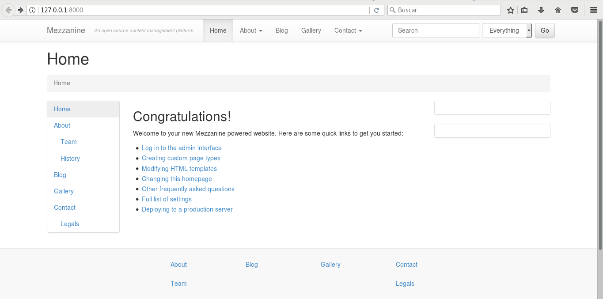
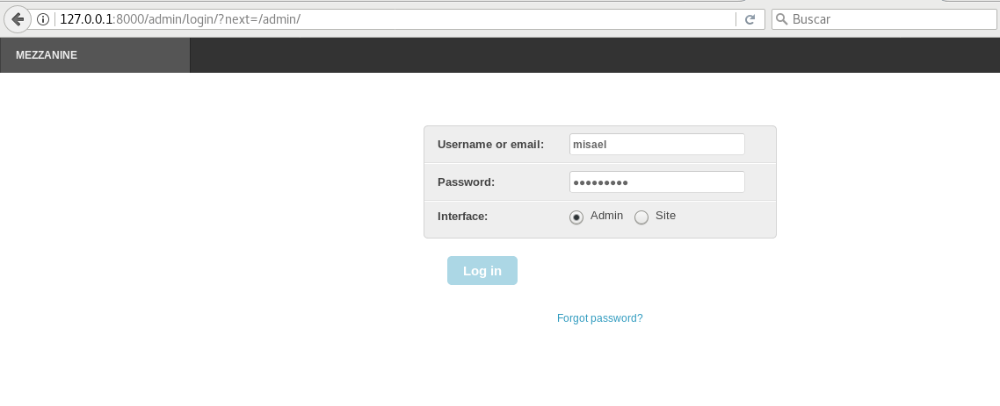
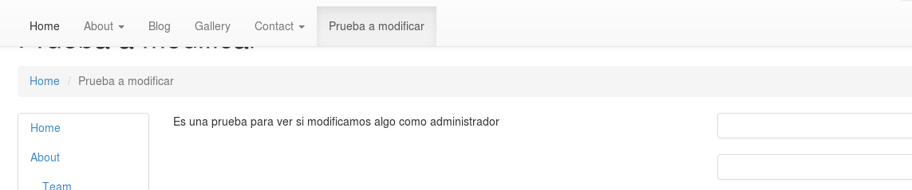

Esta practica consta de las siguientes tareas :

1. [Instalacion de Mezzanime](#Tarea1)
2. [Migracion a entorno de produccion](#Tarea2)

## Tarea1

Vamos a instalar Mezzanime y configurarlo en el entorno de produccion.

-Existen varias maneras de instalar Mezzanime , una de ellas consiste en crear un entorno virtual e instalarlo mediande la herramienta "pip"
~~~
virtualenv -p /usr/bin/python3 mezzanine
source bin/activate
pip install mezzanine
~~~
-Esto no los instalara con sus dependencias , pero ahora tendremos que generar un proyecto con el siguiente comando 
~~~
mezzanine-project (ruta y nombre)
~~~
-Esto nos creara una serie de ficheros segun la ruta especificada , lo subimos a un repo de github para poder trabajar luego en un entorno de produccion 

-Si echamos un vistazo a la estructura de ficheros , nos suena ¿eh? , es parecido a Django , asi que creamos una base de datos y la rellenamos como un pavo de objetos de prueba. 
~~~
python manage.py createdb --noinput
~~~
*createdb no es mas que un acceso rapido a "migrate" de django , si no quieres añadir opciones de prueba añade "--nodata"*

-Una vez creada la base de datos y que todo nos aparesca en color verde ( todo sabemos que el verde es bueno *ejem* ) , ejecutamos el servidor de pruebas y accedemos a la aplicacion via web .
~~~
python3 manage.py runserver
~~~

-Ahora , la aplicacion esta funcionando y esta operativa 

-vamos a  modificar algo , para ello , creamos un superuser 
~~~
python3 manage.py createsuperuser
~~~

-Ahora nos vamos a la zona de administracion 

-Creamos una nueva pagina y añadimos algo 

-Lo guardamos y nos volvemos a la pagina inicial , en la que nos aparecera la nueva pagina creada 

-Ahora veremos como subirlo a un entorno de produccion. 

## Tarea2
