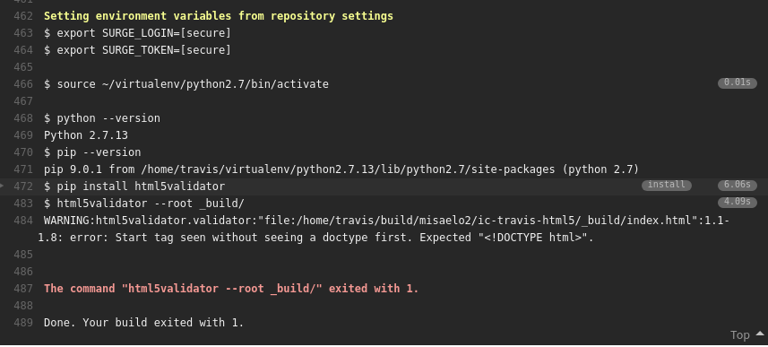

-Esta practica consta de las siguientes tareas :

1. [Intalacion y despliege de una pequeña pagina en surge.sh](#tarea2)
2.  [Despliege de un blog desarrollado con pelican en Github Page](#tarea3)
3. [Integracion continua con aplicacion Django](#tarea4)

# Tarea2

-Para utilizar la aplicacion surge.sh necesitamos instalar los requisitos necesarios :
~~~
1- apt-get install nodejs-legacy
2-  apt install build-essential libssl-dev
3- npm install express
4- npm install --global surge 
~~~
-Ahora a continuacion escribimos el comando "surge" y rellenamos la informacion para crear una cuenta
~~~
root@misael-PC:/home/misael/Plantillas# surge

    Welcome to Surge! (surge.sh)
    Please login or create an account by entering your email and password:

              email: misaelnodaquintero@gmail.com
           password: 
       project path: /home/misael/Plantillas/
               size: 1 files, 25 bytes
             domain: misael.surge.sh
             upload: [====================] 100%, eta: 0.0s
   propagate on CDN: [====================] 100% 
               plan: Free
              users: misaelnodaquintero@gmail.com
         IP Address: 45.55.110.124

    Success! Project is published and running at misael.surge.sh
~~~

-Nos vamos al dominio : 

Ahora implementaremos esta herramienta con Travis y despliege continuo , para ello :

1- Clonamos el repositorio 
2- Activamos para que travis actue en ese repositorio clonado (en el propio dashboard de travis ) 
3- Clonamos nuestro repositorio y abrimos el fichero -travis.yml para especificar nuestro dominio 
~~~
language: python
python:
 - "2.7"
addons:
  apt:
    packages:
      - oracle-java8-set-default  # install Java8 as required by vnu.jar

branches:
  only:
    - master

install:
 - pip install html5validator

script: html5validator --root _build/

deploy:
  provider: surge
  project: ./_build/
  domain: misael.surge.sh
  skip_cleanup: true
~~~

4- Generamos un token para que travis pueda desplegar en surge :
~~~ 
surge token 
~~~
5- con este token , nos vamos a la pagina de travis y creamos dos variables de entorno 
SURGE_LOGIN (correo con el que nos hemos registrado en surge)
SURGE_TOKEN (token anteriormente conseguido)

6- Ahora comprobamos que al desplegar el html sea valido se despliega automaticamente .

-Modificamos el index.html y realizamos un push para que travis monte automaticamente el repositorio , si todo sale bien ,
podremos ver el log de la maquina de travis 

-Y si accedemos a la pagina web :

-Ahora introduciremos un error en el codigo html para que no sea valido 

al realizar un push del repositorio , travis lo detecta y automaticamente comienza el despliege , como 
el validador de html5 esta mal nos da el siguiente error en el log de travis :

y en nuestro correo nos avisa :

# Tarea3

Ahora vamos a construir un sitio web con la aplicacion python llamada pelican y desplegarlo en Github Pages :

-Creamos un repositorio nuevo con un fichero Readme.md  con una rama secundaria llamada "gh-pages" 

Ahora creamos un entorno virtual e instalamos pelican :
~~~
python3 -m venv pelican
pip install pelican==3.7.1 markdown==2.6.8
~~~

Nos movemos a un directorio donde queramos guardar nuestro contenido y ejecutamos lo siguiente 
~~~
pelican-quickstart
~~~

Nos hara una serie de preguntas , las contestamos correctamente 

-En nuestra prefijo url ponemos algo como "https://misaelo2.github.io/{nombre_repo}"

-Decimos que queremos que suba nuestros Ficheros por github Pages 

Ejecutamos el servidor web de desarrollo 
~~~
make devserver
~~~

Ahora si accedemos a "localhost:8000" 

Ahora , este proceso de "build" lo queremos realizar automaticamente con travis 

-Activamos nuestro repositorio en el dashboard de travis 

-Creamos un fichero .travis.yml con el siguiente contenido :
~~~
language: python
branches:
  only:
  - master
install:
- pip install pelican ghp-import
script:
- make publish github
~~~

Ahora , creamos un token en nuestra pagina de github para acceder a la API y instalamos lo siguiente para
encriptarlo 

~~~
sudo apt-get install ruby1.9.1-dev build-essential
sudo apt install gem 
sudo gem install travis
travis encrypt GH_TOKEN=your_token
~~~

Esto nos dara un token encriptado , añadimos a nuestro fichero .travis.yml lo siguiente :
~~~
env:
  global:
    secure: your_encrypt_token
~~~

-Ahora , en nuestro directorio de proyecto modificamos el fichero Makefile 

~~~
github: publish

  ghp-import -n $(OUTPUTDIR)
  @git push -fq https://${GH_TOKEN}@github.com/$(TRAVIS_REPO_SLUG).git gh-pages > /dev/null
~~~
-Sustituimos "travis Repo Slug por nuestro repositorio " y añadimos en nuestro fichero de configuracion de pelican :
~~~
STATIC_PATHS = ['images', 'extra/CNAME']
EXTRA_PATH_METADATA = {'extra/CNAME': {'path': 'CNAME'},}
~~~

Y listo , ya deberia de estar .

# Tarea4

-Integracion continua con la aplicacion tutorial de Django 

-Primero , vamos a estudiar el fichero test.py del directorio /polls del proyecto djanngo 

-Este fichero ejecuta una serie de pruebas que si son ciertas , ejecuta la aplicacion , para comprobar las pruebas ejecutamos
~~~
python manage.py test
~~~

Si lo ejecutamos veremos que todas las pruebas se han realizado correctamente . 

Ahora estudiaremos este codigo y lo modificaremos para que alguna prueba sea erronea 

A la siguiente funcion 
~~~
def create_question(question_text, days):
    """
    Creates a question with the given `question_text` and published the
    given number of `days` offset to now (negative for questions published
    in the past, positive for questions that have yet to be published).
    """
    time = timezone.now() + datetime.timedelta(days=days)
    return Question.objects.create(question_text=question_text, pub_date=time)

~~~

La sustituimos por esta :
~~~
def create_question(question_text, days):
    """
    Creates a question with the given `question_text` and published the
    given number of `days` offset to now (negative for questions published
    in the past, positive for questions that have yet to be published).
    """
    time = timezone.now() + datetime.timedelta(days=days)
    return Question.objects.create(question_text=question_text )
~~~

- Y al ejecutar de nuevo python manage.py test nos suelta este mensaje de error 
~~~
Ran 7 tests in 0.015s

FAILED (errors=6)
Destroying test database for alias 'default'...
~~~

Ahora vamos a configurar la integracion continua para que , al hacer un commit , se ejecute la prueba test dentro de travis :

-Para ello primero creamos un fichero .travis.yml con el siguiente contenido :
~~~
language: python
install:
- pip install django==1.10
script:
- python manage.py test
~~~

-Activamos en el dashboard de travis el repositorio a monitorizar , y hacemos un commit y push en el repositorio desde nuestra terminal

Si las pruebas salen satisfactoriamente , veremos lo siguiente en el dashboard y log de travis 

Si ,por el contrario modificamos el fichero test.oy para que alguna prueba de erronea :

