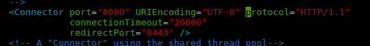

-Esta practica consta de las siguientes tareas :

1. [Intalacion y despliege en servidor Tomcat de CMS Sakai](#tarea1)

# Tarea1

-Para la practica de Java en Implantacion de aplicaciones qeb he decidido desplegar el CMS "Sakai" en un servidor Tomcat

-Para desplegar este CMS tendremos , que compilarlo y realizar varias tareas , asi que comenzemos :

Prerequisitos 
	1-Git 
	2-Apache maven 3
	3-Java 1.8 (jdk)
	4-Tomcat 8.0.32
	5-Mysql 5
	6-Conector Mysql JDBC

-Comenzamos con el servidor Tomcat :

-nos vamos a la pagina oficial y descargamos la version 8.0.32 

-La descomprimimos en /opt y hacemos un enlace simbolico 
~~~
tar xzvf apache-tomcat-8.0.32.tar.gz
ln -nsf apache-tomcat-8.0.32 tomcat
~~~
-Modificamos la codificacion de caracteres en el archivo conf/server.xml

-Ahora asignamos una serie de variables de sistema al usuario 

~~~
apt-get install maven
export JAVA_HOME=/usr/lib/jvm/java-1.8.0-openjdk-amd64
export MAVEN_HOME=/usr/share/maven
export CATALINA_HOME=/opt/tomcat
export PATH=$PATH:$JAVA_HOME/bin:$MAVEN_HOME/bin:$CATALINA_HOME/bin
export MAVEN_OPTS='-Xms512m -Xmx1024m -Djava.util.Arrays.useLegacyMergeSort=true'
~~~

Configuramos las Bases de datos 

~~~
mysql> create database sakaidatabase default character set utf8;
mysql> grant all on sakaidatabase.* to sakaiuser@'localhost' identified by 'sakaipassword';
mysql> grant all on sakaidatabase.* to sakaiuser@'127.0.0.1' identified by 'sakaipassword';
mysql> flush privileges;
mysql> quit
~~~

-Ahora nos descargamos el conector Mysql de su pagina principal y lo copiamos el archivo .jar  en $CATALINA_HOME/lib

-creamos el directorio $CATALINA_HOME/sakai
~~~
mkdir  $CATALINA_HOME/sakai
~~~

-creamos un archivo local.properties y añadimos las siguientes lineas (reemplazar por el nombre de nuestras bases de datos y usuarios )

~~~
## MySQL settings
username@javax.sql.BaseDataSource=sakaiuser   #whatever username you assigned in the database setup
password@javax.sql.BaseDataSource=sakaipassword #whatever password you assigned to the sakaiuser in the database setup

# use your sakaidatabase name in the URI that starts url@javax.sql.BaseDataSource= , below.

vendor@org.sakaiproject.db.api.SqlService=mysql
driverClassName@javax.sql.BaseDataSource=com.mysql.jdbc.Driver
hibernate.dialect=org.hibernate.dialect.MySQL5InnoDBDialect
url@javax.sql.BaseDataSource=jdbc:mysql://127.0.0.1:3306/sakaidatabase?useUnicode=true&characterEncoding=UTF-8
validationQuery@javax.sql.BaseDataSource=select 1 from DUAL
defaultTransactionIsolationString@javax.sql.BaseDataSource=TRANSACTION_READ_COMMITTED
~~~

-Nos vamos a $CATALINA_HOME/bin y creamos un archivo ejecutable llamado "setenv.sh"

-A este archivo le añadimos los siguiente :
~~~
export JAVA_OPTS='-server -Xms512m -Xmx1024m -XX:PermSize=128m -XX:NewSize=192m -XX:MaxNewSize=384m -Djava.awt.headless=true -Dhttp.agent=Sakai -Dorg.apache.jasper.compiler.Parser.STRICT_QUOTE_ESCAPING=false -Dsun.lang.ClassLoader.allowArraySyntax=true -Djava.util.Arrays.useLegacyMergeSort=true -Dsakai.demo=true'
~~~

* la opcion "demo" sirve para poblar nuestro sakai con una muestras de alumnos y profesores 

-Clonamos el repositorio Github de Sakai y compilamos el codigo :

~~~
git clone https://github.com/sakaiproject/sakai.git
cd sakai && git checkout 11.2
cd master
mvn clean install 
~~~

comenzara el procesode compilacion , tardara unos segundos 

-Ahora compilamos y ejecutamos en nuestro servidor Tomcat :

~~~
mvn clean install sakai:deploy -Dmaven.tomcat.home=$CATALINA_HOME -Djava.net.preferIPv4Stack=true -Dmaven.test.skip=true
~~~

-Ahora nos vamos a $CATALINA_HOME/bin (nuestro servidor Tomcat) y iniciamos el servidor 

~~~
./startup.sh
~~~

-Ahora accedemos a nuestro localhost:8080

-Nuestro servidor Tomcat esta funcionando , accedemos a la url "/portal" y vemos el fruto de nuestros resultados :

 
