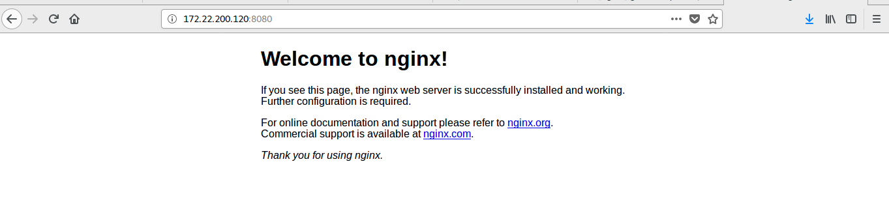

Hoy comenzaremos con algo que lo esta petando ultimamente , contenedores , en especial , los de docker .

1. [Ejecutando un servicio en un contenedor docker](#tarea1)

2. [Creacion de una imagen de docker con Dockerfile](#tarea2)

3. [Configuracion de contenedores por medio de variables de entorno](#tarea3)

4. [Creacion automatica de una imagen docker en dockerHub](#tarea4)

# Tarea1

Primeros , tenemos que instalar docker , dado que en muchos sitios te explican como instalar docker de distintas fuentes ( y seguramente mejor que yo) pasaremos directamente a usar docker una vez instalado :

-En docker hub encontramos un repositorio con imagenes de contenedores de servicios o incluso SO para usar , vamos a crear un contenedor docker interactivo con una imagen oficial de debian y vamos a instalarse el servidor Nginx 

Nos bajamos la imagen 

~~~
docker pull debian
~~~

podemos ver si nos hemos descargado la imagen y las imagenes que tenemos con el comando 

~~~
docker images
~~~

como siempre el comando "docker --help" sera nuestro gran amigo a la hora de enfrentarnos contra este señor 

Con la imagen que nos hemos descargados , ejecutamos un contenedor 

~~~
docker run -i -t --name primero debian /bin/bash
~~~

la opcion -i es para decirle que sera un contenedor interactivo , la -t para ordenarlo que abra una terminal en el contenedor , y el comando escrito al final es lo que se ejecutara en el contenedor 

Ahora ejecutamos los comandos necesario para instalar nginx 

~~~
apt-get update 
apt-get install nginx
~~~

Ahora vamos a crear una  imagen con ese contenedor que hemos creado para que asi tener una imagen con nginx lista  para el despliege 

docker commit -m "añadido nginx" -a "misaelo" 926045cfed4e misael/nginx:v1

Si ahora listamos la imagen debe aparecernos el nombre de la nuestra 

Lo que debemos hacer ahora es crear un contenedor nuevo con la imagen que hemos creado , que incluira nginx ya .
~~~
docker run -d -p 8080:80 --name segundo misael/nginx:v1 /usr/sbin/nginx -g "daemon off;" 
~~~

con la opcion - d le especificamos a docker para que ejecute el contenedor como un demonio , -p  para especificar el mapeo de puertos y por ultimo escribi el comando a ejecutar 

si accedemos a la ip del servidor docker por la ip y el puerto 8080 , nos aparecera la pagina principal del nginx del contenedor .

una vez comprobado que el contenedor esta hecho correctamente , nos creamos una cuenta en docker hub y lo subimos a nuestro repositorio 

~~~
docker login
docker tag misael/nginx:v1 misaelo/nginx:v1
docker push misaelo/nginx:v1
~~~

el comando docker tag sirve para etiquetar nuestra imagen con diferentes versiones para documentar los cambios que vamos haciendo

la imagen aparecera en nuestro docker cloud 

Si ahora queremos descargarnos esta imagen en el entorno de produccion solo tendriamos que ejecutar el comando que nos dice la pagina de docker cloud

~~~
docker push misaelo/nginx:v1
~~~

y para ejecutarlo docker start misaelo/nginx:v1

Para hacer Mysql en un Contenedor :

