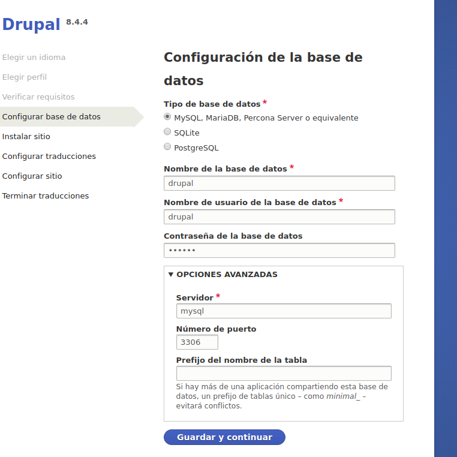

Despliege de aplicaciones en Dockerfiles

1. [Ejecucion de una aplicacion web php en Docker ](#tarea1)

2. [Ejecucion de una aplicacion web php en Docker (2) ](#tarea2)

3. [Ejecucion de una aplicacion web php en Docker (3)](#tarea3)

4. [Ejecucion de CMS en docker ](#tarea4)

5. [Ejecucion de CMS en docker (2) ](#tarea5)

# Tarea1

Para el despliege he elegido una aplicacion escrita en php que no dispone de repositorio oficial , asi nosotros nos la aviamos para desplegar esta aplicacion en contenedores 

Clonamos el repositorio de [bookmedik](https://github.com/evilnapsis/bookmedik)

Primero , creamos la base de datos :

~~~
docker pull mysql/mysql-server
~~~

Ahora ejecutamos un contenedor que contendra un servidor mysql 

~~~
 docker run --name mysql -e MYSQL_ROOT_PASSWORD=root -e MYSQL_DATABASE=bookmedik -e MYSQL_USER=bookmedik -e MYSQL_PASSWORD=bookmedik  -d mysql
~~~

Cargamos en la base de datos el archivo "schema.sql" 

~~~
cat schema.sql | docker exec -i mysql /usr/bin/mysql -u bookmedik --password=bookmedik bookmedik
~~~

Con esto hemos creado La base de datos en en nuestro contenedor 
Ahora , como no queremos estar creando constantemente la base de datos al crear y destruir contenedores,
vamos a ver volumenes :

~~~
docker volume create --name bookmedik
~~~

con esto creamos un volumen que usaremos para conectarlos a los contenedores
pero vamos a borrarlo y a crear el volumen justo al crear el contenedor de la base de datos 

~~~
docker volume rm  bookmedik
docker run --name mysql -e MYSQL_ROOT_PASSWORD=root -e MYSQL_DATABASE=bookmedik -e MYSQL_USER=bookmedik -e MYSQL_PASSWORD=bookmedik  -d \
-v bookmedik:/var/lib/mysql mysql
cat schema.sql | docker exec -i mysql /usr/bin/mysql -u bookmedik --password=bookmedik bookmedik
~~~

~~~
Con esto , si eliminamos el contenedor , solo tenemos que enganchar el volumen a otro contenedor mysql 
Para comprobar la informacion contenida en el contenedor :
~~~

~~~
docker inspect bookmedik 
~~~

Aqui nos mostrara el directorio en nuestro sistema de archivos local donde guarda los datos 

Ahora creamos un dockerfile con una imagen base de debian y añadimos la aplicacion 
(acordad situarnos en la carpeta del directorio creado)
~~~
FROM debian 

ADD . /var/www/html

RUN apt-get update \
&& apt-get install -y apache2 \
&& apt-get install  -y php libapache2-mod-php

EXPOSE 80

CMD apachectl -D FOREGROUND
~~~

Antes de buildear la imagen tenemos que retocar los parametros de la conexion en la base de datos en core/controller/Database.php

~~~
<?php
class Database {
        public static $db;
        public static $con;
        function Database(){
                $this->user="bookmedik";$this->pass="bookmedik";$this->host="mysql";$this->ddbb="bookmedik";
        }

        function connect(){
                $con = new mysqli($this->host,$this->user,$this->pass,$this->ddbb);
                $con->query("set sql_mode=''");
                return $con;
        }

        public static function getCon(){
                if(self::$con==null && self::$db==null){
                        self::$db = new Database();
                        self::$con = self::$db->connect();
                }
                return self::$con;
        }

}
?>
~~~

Buildeamos la imagen 

~~~
Docker build -t bookmedik .
~~~

Ahora creamos el contenedor con un volumen para guardar los logs de apache y lo enlazamos con el servidor mysql para que resuelva los nombres 

~~~
docker run --name bookmedik -d --link mysql:mysql -v logs_bookmedik:/var/log/apache2/ -p 80:80 bookmedik 
~~~

Ahora accedemos a la direccion de la maquina host 

# Tarea2

Ahora vamos a desplegar la aplicacion con la imagen oficial de php de Docker Hub 

Segun la documentacion oficial de la imagen , para desplegar php con apache usamos el siguiente dockerfile 

~~~
FROM php:7.0-apache

ADD . /var/www/html

#instalamos dependencias necesarias 

RUN docker-php-ext-install mysqli && docker-php-ext-enable mysqli
~~~

Ahora etiquetamos la imagen y la subimos a nuestro docker hub :

~~~
docker tag bookmedik_php:latest  misaelo/bookmedik:v1
docker push misaelo/bookmedik:v1
~~~

-Aqui esta mi repositorio de GitHub con el contexto de la imagen : [bookmedik](https://github.com/misaelo2/Bookmedik)

Con esta imagen y nuestro antiguo contenedor de mysql , podemos crear la aplicacion , pero esta ves lanzaremos los dos mediante docker compose 

docker compose no es mas que una herramienta que nos permite desplegar varios contenedores con la configuracion deseado que le hemos escrito en un archivo YML previamente definido en vez de tener que ejecutar "docker run" . Si habeis visto Ansible , es una cosa Muy parecida 

Instalamos Docker Compose 

~~~
curl -L https://github.com/docker/compose/releases/download/1.19.0/docker-compose-`uname -s`-`uname -m` -o /usr/local/bin/docker-compose

chmod +x /usr/local/bin/docker-compose 
docker-compose --version 
~~~

Con este ultimo comando podemos ver la version instalada de docker-compose , Ahora pasaremos a definir el escenario con un fichero YML :

~~~
mysql:
   image: mysql
   environment:
      MYSQL_ROOT_PASSWORD: root
      MYSQL_DATABASE: bookmedik 
      MYSQL_USER: bookmedik
      MYSQL_PASSWORD: bookmedik   
   volumes:
     - bookmedik:/var/lib/mysql
bookmedik_php
   image: bookmedik_php
   links: 
      -mysql
   ports:
      -"80:80"
~~~
* Nota , el fichero debe llamarse "docker-compose.yml"

Ahora levantamos la herramienta docker-compose y creamos el escenario 

~~~
docker-compose up -d
~~~

- la opcion -d es para que nos muestre la salida del estado 

Comprobamos los contenedores creados :

* Nota , aun no tengo claro el porque docker-compose asigna esos nombres tan raros , tendre que investigar

Accedemos a nuestra aplicacionsita nomas 

# Tarea3

Ahora , como este despliege me sabe a poco , vamos a aumentar el numero de contenedores a tres  en los que serviremos :

- Contenedor1 : Nginx 

- Contenedor2 : php-fpm

- Contenedor3 : nuestra aplicacion 

Manos a la obra :

- nginx.conf ( configuracion de nginx  para el contenedor 1)

Creamos el docker-compose.yml para que lo cree todo automaticamente 

~~~
web:
    image: nginx:latest
    ports:
        - "80:80"
    volumes:
        - ./:/var/www/html/
        - ./nginx.conf:/etc/nginx/nginx.conf
    links:
        - php
php:
    image: superphp
    volumes:
        - ./:/var/www/html
    links:
        - mysql
mysql:
  image: mysql
  environment:
    MYSQL_ROOT_PASSWORD: root
    MYSQL_DATABASE: bookmedik
    MYSQL_USER: bookmedik
    MYSQL_PASSWORD: bookmedik
  volumes:
    - bookmedik:/var/lib/mysql

~~~

Ahora  lanzamos el escenario y accedemos a nuestra aplicacion

# Tarea4 

Realizaremos un despliege de un gestor de contenido multimedia en docker , en este caso , TEXTPATTERN :

Nos descargamos el paquete desde su pagina oficial ,lo descomprimimos  y nos situamos en ese directorio

creamos las imagenes necesarias con un dockerfile 

~~~
FROM debian 

ADD ./textpattern-4.6.2 /var/www/html

RUN apt-get update && apt-get install apache2 \
&& apt-get install libapache2-mod-php7.0 php7.0-mysqli php7.0-xml

CMD apachectl -D FOREGROUND

~~~

~~~
Docker pull mysql 
~~~

Creamos los volumenes necesarios para hacer nuestra aplicacion persistente 
~~~
docker volume create --name textpattern
docker volume create --name mysql
~~~

Esto hara que la informacion sea persistente 

tambien editamos  un fichero en texpattern/config-sit.php con los datos de la conexion a mysql y le cambiamos el nombre por config.php y añadimos a ese fichero lo siguiente eliminando lo que habia antes :

~~~
<?php
$txpcfg['db'] = 'textpattern';
$txpcfg['user'] = 'textpattern';
$txpcfg['pass'] = 'textpattern';
$txpcfg['host'] = 'mysql';
$txpcfg['table_prefix'] = '';
$txpcfg['txpath'] = '/var/www/html/textpattern';
$txpcfg['dbcharset'] = 'utf8mb4';
?>
~~~

Ahora creamos un docker-compose.yml donde estara toda la magia :

~~~
mysql:
   image: mysql
   environment:
      MYSQL_ROOT_PASSWORD: root
      MYSQL_DATABASE: textpattern
      MYSQL_USER: textpattern
      MYSQL_PASSWORD: textpattern
   volumes:
     - mysql:/var/lib/mysql

textpattern:
   image: textpattern
   links:
      -mysql
   ports:
      -"80:80"
   volumes: 
      - textpattern:/var/www/html
~~~

Como observamos , la aplicacion se ha desplegado correctamente

*Nota : debido a esta es la primera instalacion de cms , no tengo las tablas creados y tengo que seguir los pasos de configuracion 
que , traduciendose , hay que cambiar un fichero manualmente en el contenedor . lo se , los contenedores no son para eso , pero , una vez hayamos creado la base de datos debido a que se guarda en un volumen no hara falta mas este paso*
~~~
docker cp textpattern-4.6.2/textpattern/config.php  prueba_textpattern_1:/var/www/html/textpattern
~~~

 

Ya esta listo , como observacion final diria que este CMS NO ESTA HECHO PARA SER DESPLEGADO EN CONTENEDORES  y eso se nota a la hora de tener que configurar la base de datos . 

# Tarea5

Ahora , realizaremos el despliege de un CMS usando la documentacion oficial de docker hub 
Nos descargamos la imagen 
~~~
docker pull drupal
~~~
Preparamos el docker compose 

~~~
mysql:
   image: mysql
   environment:
      MYSQL_ROOT_PASSWORD: root
      MYSQL_DATABASE: drupal
      MYSQL_USER: drupal
      MYSQL_PASSWORD: drupal
   volumes:
     - mysql:/var/lib/mysql

textpattern:
   image: drupal
   links:
      -mysql
   ports:
      -"80:80"
~~~

sencillo , rapido y para toda la familia, esto si que es un CMS en condiciones ¡ 

Aqui vemos drupal instalado :

nota : se ve sin estilos porque al instalar he configurado la instalacion minima y no he configurado un volumen para los themes 

Si vemos los logs del contenedor veremos como no nos da fallo de que no se encuentra algun fichero css
~~~
172.17.0.1 - - [12/Feb/2018:19:30:43 +0000] "GET /sites/default/files/js/js_ei1vH-V_SQc6NPapxfNNKWz22B_AMHNw0wAScJrimbk.js HTTP/1.1" 200 34189 "http://localhost/admin/content" "Mozilla/5.0 (X11; Linux x86_64) AppleWebKit/537.36 (KHTML, like Gecko) Chrome/64.0.3282.140 Safari/537.36"
172.17.0.1 - - [12/Feb/2018:19:30:48 +0000] "GET /admin/content HTTP/1.1" 200 2367 "http://localhost/admin/content" "Mozilla/5.0 (X11; Linux x86_64) AppleWebKit/537.36 (KHTML, like Gecko) Chrome/64.0.3282.140 Safari/537.36"
172.17.0.1 - - [12/Feb/2018:19:30:48 +0000] "GET /sites/default/files/js/js_ei1vH-V_SQc6NPapxfNNKWz22B_AMHNw0wAScJrimbk.js HTTP/1.1" 200 34189 "http://localhost/admin/content" "Mozilla/5.0 (X11; Linux x86_64) AppleWebKit/537.36 (KHTML, like Gecko) Chrome/64.0.3282.140 Safari/537.36"
172.17.0.1 - - [12/Feb/2018:19:30:51 +0000] "GET / HTTP/1.1" 302 853 "http://localhost/admin/content" "Mozilla/5.0 (X11; Linux x86_64) AppleWebKit/537.36 (KHTML, like Gecko) Chrome/64.0.3282.140 Safari/537.36"
172.17.0.1 - - [12/Feb/2018:19:30:51 +0000] "GET /user/1 HTTP/1.1" 200 2071 "http://localhost/admin/content" "Mozilla/5.0 (X11; Linux x86_64) AppleWebKit/537.36 (KHTML, like Gecko) Chrome/64.0.3282.140 Safari/537.36"
172.17.0.1 - - [12/Feb/2018:19:30:51 +0000] "GET /sites/default/files/js/js_7iAMY-QogFSl0s3kbbylsdZDiyt5vmx9h5DXO55pYGY.js HTTP/1.1" 200 2925 "http://localhost/user/1" "Mozilla/5.0 (X11; Linux x86_64) AppleWebKit/537.36 (KHTML, like Gecko) Chrome/64.0.3282.140 Safari/537.36"
172.17.0.1 - - [12/Feb/2018:19:30:51 +0000] "GET /sites/default/files/css/css_ySMN6YAkrL93FpFl1k5IR8uT3McTZRC0iiihUqlOvIg.css?0 HTTP/1.1" 200 2267 "http://localhost/user/1" "Mozilla/5.0 (X11; Linux x86_64) AppleWebKit/537.36 (KHTML, like Gecko) Chrome/64.0.3282.140 Safari/537.36"
172.17.0.1 - - [12/Feb/2018:19:30:54 +0000] "GET /node/add HTTP/1.1" 200 1986 "http://localhost/user/1" "Mozilla/5.0 (X11; Linux x86_64) AppleWebKit/537.36 (KHTML, like Gecko) Chrome/64.0.3282.140 Safari/537.36"
172.17.0.1 - - [12/Feb/2018:19:31:02 +0000] "GET /admin/structure/types/add HTTP/1.1" 200 4566 "http://localhost/node/add" "Mozilla/5.0 (X11; Linux x86_64) AppleWebKit/537.36 (KHTML, like Gecko) Chrome/64.0.3282.140 Safari/537.36"
172.17.0.1 - - [12/Feb/2018:19:31:07 +0000] "GET /sites/default/files/css/css_DoDt1X0KSlkyGCFQy7-ZM7m_vcyk0SubsI9DLvSkYgs.css?0 HTTP/1.1" 200 3747 "http://localhost/admin/structure/types/add" "Mozilla/5.0 (X11; Linux x86_64) AppleWebKit/537.36 (KHTML, like Gecko) Chrome/64.0.3282.140 Safari/537.36"
172.17.0.1 - - [12/Feb/2018:19:31:07 +0000] "GET /sites/default/files/js/js_Vhw_sIDGvKrY1CgMvT6eAIH7KZzr4dFW4SDku-J-c4w.js HTTP/1.1" 200 38607 "http://localhost/admin/structure/types/add" "Mozilla/5.0 (X11; Linux x86_64) AppleWebKit/537.36 (KHTML, like Gecko) Chrome/64.0.3282.140 Safari/537.36"
172.17.0.1 - - [12/Feb/2018:19:31:52 +0000] "GET / HTTP/1.1" 302 854 "http://localhost/admin/structure/types/add" "Mozilla/5.0 (X11; Linux x86_64) AppleWebKit/537.36 (KHTML, like Gecko) Chrome/64.0.3282.140 Safari/537.36"
172.17.0.1 - - [12/Feb/2018:19:31:52 +0000] "GET /user/1 HTTP/1.1" 200 2071 "http://localhost/admin/structure/types/add" "Mozilla/5.0 (X11; Linux x86_64) AppleWebKit/537.36 (KHTML, like Gecko) Chrome/64.0.3282.140 Safari/537.36"
172.17.0.1 - - [12/Feb/2018:19:31:52 +0000] "GET /sites/default/files/css/css_ySMN6YAkrL93FpFl1k5IR8uT3McTZRC0iiihUqlOvIg.css?0 HTTP/1.1" 200 2267 "http://localhost/user/1" "Mozilla/5.0 (X11; Linux x86_64) AppleWebKit/537.36 (KHTML, like Gecko) Chrome/64.0.3282.140 Safari/537.36"
172.17.0.1 - - [12/Feb/2018:19:31:52 +0000] "GET /sites/default/files/js/js_BKcMdIbOMdbTdLn9dkUq3KCJfIKKo2SvKoQ1AnB8D-g.js HTTP/1.1" 200 681 "http://localhost/user/1" "Mozilla/5.0 (X11; Linux x86_64) AppleWebKit/537.36 (KHTML, like Gecko) Chrome/64.0.3282.140 Safari/537.36"
172.17.0.1 - - [12/Feb/2018:19:31:52 +0000] "GET /sites/default/files/js/js_7iAMY-QogFSl0s3kbbylsdZDiyt5vmx9h5DXO55pYGY.js HTTP/1.1" 200 2924 "http://localhost/user/1" "Mozilla/5.0 (X11; Linux x86_64) AppleWebKit/537.36 (KHTML, like Gecko) Chrome/64.0.3282.140 Safari/537.36"
~~~
